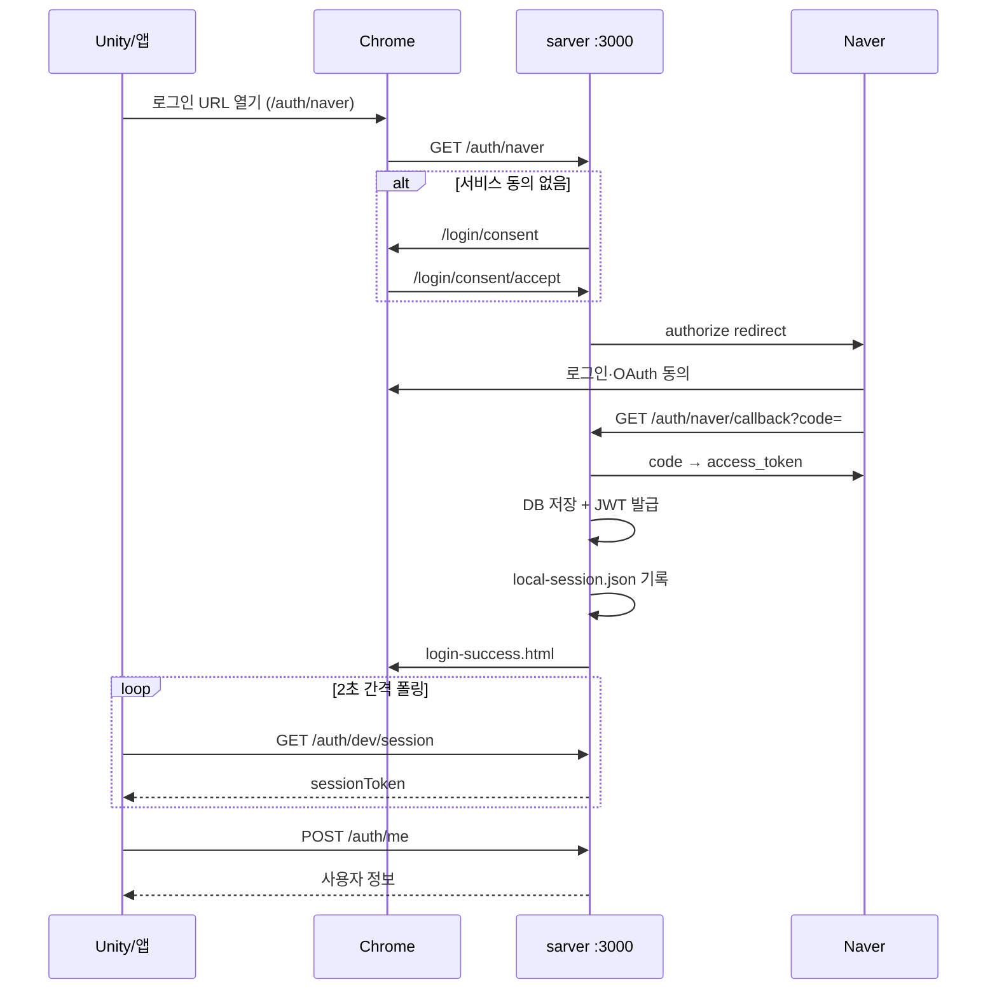

# 웹 로그인 아키텍처 (이식·확장용)

이 문서는 **naver-login-project**에서 구현한 **브라우저 기반 OAuth 로그인 + 게임/앱 클라이언트 연동** 패턴을 정리합니다.

다른 프로젝트에 그대로 옮기거나, **네이버가 아닌 Google·Kakao·Apple** 등 다른 플랫폼을 추가할 때 참고용으로 쓰세요.

> 레포 내부 운영 가이드: [system-guide.md](./system-guide.md)

---

## 1. 설계 목표

| 목표 | 설명 |
|------|------|
| **클라이언트는 얇게** | 게임/앱은 `sessionToken`(JWT)만 저장·전송 |
| **OAuth 비밀키는 서버만** | Client Secret, refresh token은 서버·DB에만 |
| **브라우저에서 로그인** | WebView 대신 **시스템 브라우저**(Chrome)로 OAuth·동의 처리 |
| **자동 로그인** | 앱 시작 시 `POST /auth/me`로 JWT 검증 |
| **플랫폼 교체 가능** | Naver 전용 코드와 **공통 골격** 분리 |

---

## 2. 레이어 구조 (플랫폼 무관)

```
┌─────────────────────────────────────────────────────────────┐
│  클라이언트 (Unity / 모바일 / 데스크톱)                        │
│  - 로그인 버튼 → 브라우저 URL 열기                              │
│  - sessionToken 저장 (PlayerPrefs 등)                        │
│  - POST /auth/me, /auth/logout                              │
│  - (선택) 브리지 폴링 또는 HttpListener 콜백                   │
└───────────────────────────┬─────────────────────────────────┘
                            │ HTTP (JWT)
┌───────────────────────────▼─────────────────────────────────┐
│  인증 서버 (Express 등)                                       │
│  ┌─────────────┐  ┌──────────────┐  ┌─────────────────────┐ │
│  │ 공통 API     │  │ 서비스 동의   │  │ Provider Adapter    │ │
│  │ /auth/me    │  │ /login/consent│  │ naver-auth.js       │ │
│  │ /auth/logout│  │ (쿠키)       │  │ google-auth.js …    │ │
│  └─────────────┘  └──────────────┘  └──────────┬──────────┘ │
│  ┌─────────────┐  ┌──────────────┐             │            │
│  │ JWT 발급    │  │ 로컬 브리지   │             │            │
│  │ user-tokens │  │ bridge 파일  │             │            │
│  └─────────────┘  └──────────────┘             │            │
└───────────────────────────┬──────────────────┼────────────┘
                            │                  │
                     MySQL users          OAuth Provider
```

### 역할 분담 (다른 플랫폼에도 동일)

| 레이어 | 책임 | Naver에 종속? |
|--------|------|----------------|
| **클라이언트** | UI, `sessionToken` 보관, 브라우저 열기 | ❌ |
| **공통 API** | JWT 검증, 로그아웃, 세션 무효화 | ❌ |
| **서비스 동의** | 우리 서비스 약관 (브라우저 HTML) | ❌ |
| **Provider Adapter** | authorize URL, code 교환, 프로필, revoke | ✅ (플랫폼별) |
| **DB** | uid, 프로필, **플랫폼 토큰**(암호화) | 컬럼명만 공통화 가능 |
| **브리지** | 브라우저 로그인 → 클라이언트 동기화 | ❌ |

---

## 3. 로그인 시퀀스 (현재 구현)



### 클라이언트에 전달하는 토큰은 하나

앱이 직접 다루는 것은 **`sessionToken`(JWT)** 뿐입니다.  
Naver `access_token` / `refresh_token`은 **서버 DB에만** 저장합니다.

---

## 4. 공통 API 계약 (플랫폼 무관)

다른 OAuth를 붙여도 **아래 API는 그대로 유지**하는 것을 권장합니다.

| 메서드 | 경로 | Body / Header | 응답 |
|--------|------|---------------|------|
| POST | `/auth/me` | `Authorization: Bearer {sessionToken}` 또는 body | `{ success, data: { user } }` |
| POST | `/auth/refresh` | sessionToken | 새 sessionToken |
| POST | `/auth/logout` | sessionToken | 세션 무효화 + (권장) provider 토큰 폐기 |

### Provider 전용 (경로에 플랫폼명)

| 메서드 | 경로 (예시) | 설명 |
|--------|-------------|------|
| GET | `/auth/{provider}` | OAuth 시작 (`naver`, `google`, `kakao` …) |
| GET | `/auth/{provider}/callback` | OAuth 콜백 |

현재 Naver 구현:

- `GET /auth/naver`
- `GET /auth/naver/callback`

---

## 5. 서비스 동의 (우리 앱 약관) — 플랫폼 무관

Naver OAuth 동의와 **별개**로, 우리 서비스 이용 약관을 브라우저에서 먼저 받습니다.

| 항목 | 현재 구현 |
|------|-----------|
| 페이지 | `login-consent.html` |
| 경로 | `GET /login/consent` |
| 동의 저장 | 쿠키 `naver_service_consent` (이름은 `service_consent` 등으로 일반화 가능) |
| 게이트 | `GET /auth/naver` 진입 전 쿠키 확인 |
| 초기화 | localhost 쿠키 삭제, `GET /login/consent/revoke` |

다른 플랫폼 추가 시:

```text
GET /auth/google  →  (서비스 동의 없으면) /login/consent  →  /auth/google
```

**서비스 동의 모듈은 provider와 공유**하면 됩니다.

---

## 6. 브라우저 ↔ 클라이언트 동기화 (브리지)

Unity WebView 없이 **외부 Chrome**으로 로그인할 때, OAuth 완료 후 앱이 토큰을 받는 패턴입니다.

### 방식 A: 로컬 브리지 파일 (현재 기본)

| 항목 | 내용 |
|------|------|
| 파일 | `%USERPROFILE%\.naver-login-project\local-session.json` |
| 기록 | OAuth 콜백 성공 시 서버가 `sessionToken` 저장 |
| 조회 | 앱이 `GET /auth/dev/session` 폴링 (로컬 전용) |
| 모듈 | `local-session-bridge.js` |

다른 프로젝트에서는 디렉터리명만 변경:

```text
~/.{your-app-name}/local-session.json
```

### 방식 B: HttpListener 콜백 (보조)

| 항목 | 내용 |
|------|------|
| URL | `http://127.0.0.1:7777/...` |
| 사용 | `?delivery=unity` 등 쿼리로 분기 |
| 모듈 | `NaverLoginCallbackListener.cs` |

모바일/웹앱 이식 시에는 **딥링크** `myapp://auth/callback?token=` 로 대체하는 경우가 많습니다.

---

## 7. HTML 페이지 (웹 UI)

| 파일 | 용도 | 플랫폼 종속 |
|------|------|-------------|
| `login-consent.html` | 서비스 이용 동의 | ❌ |
| `login-success.html` | OAuth 성공 결과 표시 | ❌ (payload만 주입) |
| `login.html` | 로그인 진입 미리보기 | ❌ |
| `login-dev.html` | mock 로그인 (개발용) | ❌ |
| `naver-setup.html` | Naver Callback URL 안내 | ✅ |

새 플랫폼 추가 시 HTML은 **공통 페이지 재사용**, provider별 설정 페이지만 추가하면 됩니다.

---

## 8. 데이터 모델 (확장 예시)

### 현재 `users` 테이블 (Naver 단일)

| 컬럼 | 설명 |
|------|------|
| `uid` | Provider 사용자 ID |
| `email`, `name` | 프로필 |
| `naver_access_token` | 암호화 |
| `naver_refresh_token` | 암호화 |
| `token_expires_at` | access 만료 |
| `session_version` | JWT 무효화용 |

### 여러 플랫폼 지원 시 권장 스키마

**옵션 1 — 컬럼 추가 (소규모)**

```sql
ALTER TABLE users ADD COLUMN auth_provider VARCHAR(32) NOT NULL DEFAULT 'naver';
ALTER TABLE users ADD COLUMN google_access_token TEXT NULL;
-- UNIQUE (auth_provider, uid)
```

**옵션 2 — 별도 테이블 (권장)**

```sql
CREATE TABLE user_oauth_tokens (
  id INT AUTO_INCREMENT PRIMARY KEY,
  user_id INT NOT NULL,
  provider VARCHAR(32) NOT NULL,  -- 'naver' | 'google' | 'kakao'
  provider_uid VARCHAR(128) NOT NULL,
  access_token TEXT,
  refresh_token TEXT,
  expires_at DATETIME,
  UNIQUE KEY (provider, provider_uid)
);
```

`user-tokens.js`의 저장·갱신·revoke 로직만 provider별 adapter로 분기하면 됩니다.

---

## 9. Provider Adapter 인터페이스 (이식 시 구현할 것)

새 플랫폼용 모듈(예: `google-auth.js`)은 아래 함수를 맞추면 `app.js` 라우트를 거의 그대로 재사용할 수 있습니다.

```javascript
// 의사 코드 — 플랫폼별 auth 모듈이 구현할 API

module.exports = {
  getConfig(),              // clientId, clientSecret, callbackUrl
  buildAuthorizeUrl(),      // 브라우저 redirect URL
  exchangeCodeForToken(code, state),
  refreshAccessToken(refreshToken),
  revokeAccessToken(accessToken),  // 또는 provider revoke API
  fetchProfile(accessToken),
  mapProfileToUser(profile),       // → { uid, email, name }
};
```

### Naver 현재 매핑 (`naver-auth.js`)

| 함수 | Naver API |
|------|-----------|
| `buildAuthorizeUrl` | `GET https://nid.naver.com/oauth2.0/authorize` |
| `exchangeCodeForToken` | `grant_type=authorization_code` |
| `refreshAccessToken` | `grant_type=refresh_token` |
| `revokeAccessToken` | `grant_type=delete` |
| `fetchProfile` | `GET https://openapi.naver.com/v1/nid/me` |

### 다른 플랫폼 참고

| 플랫폼 | Authorize | Token | Revoke |
|--------|-----------|-------|--------|
| Google | `accounts.google.com/o/oauth2/v2/auth` | `oauth2.googleapis.com/token` | `oauth2.googleapis.com/revoke` |
| Kakao | `kauth.kakao.com/oauth/authorize` | `kauth.kakao.com/oauth/token` | `kapi.kakao.com/v1/user/unlink` |

콜백 라우트만 추가:

```javascript
app.get('/auth/google', gateConsent, (req, res) => res.redirect(googleAuth.buildAuthorizeUrl()));
app.get('/auth/google/callback', handleOAuthCallback('google'));
```

`handleOAuthCallback`는 **공통 함수**로 추출하는 것이 이식에 유리합니다.

---

## 10. JWT 세션 (`session-jwt.js` + `user-tokens.js`)

플랫폼과 무관한 **앱 세션** 레이어입니다.

| 항목 | 설명 |
|------|------|
| 발급 | OAuth 콜백 성공 후 `issueSessionToken(user)` |
| 검증 | `POST /auth/me`, `getUserFromSessionToken()` |
| 무효화 | `session_version` 증가 (`clearUserSession`, 로그아웃) |
| 환경 변수 | `SESSION_JWT_SECRET`, `SESSION_JWT_TTL_SECONDS` |

앱은 **provider가 naver인지 google인지 알 필요 없음**. 서버만 알면 됩니다.

---

## 11. 클라이언트 연동 체크리스트 (Unity → 다른 앱)

| 단계 | Unity (현재) | 다른 앱으로 옮길 때 |
|------|--------------|---------------------|
| 1 | 로그인 버튼 | 동일 |
| 2 | `Application.OpenURL` / Chrome | `Intent`, `SFSafariViewController`, `window.open` |
| 3 | `authUrl = .../auth/{provider}` | provider만 변경 |
| 4 | 브리지 폴링 `GET /auth/dev/session` | 동일 또는 딥링크 |
| 5 | `sessionToken` → PlayerPrefs | Keychain, SecureStorage 등 |
| 6 | `POST /auth/me` | 동일 |
| 7 | 로그아웃 `POST /auth/logout` | 동일 |

### 현재 Unity 핵심 파일

| 파일 | 역할 |
|------|------|
| `test.cs` | Chrome 열기, 폴링, `/auth/me` |
| `NaverLoginCallbackListener.cs` | PlayerPrefs, HTTP, :7777 (보조) |

이식 시 `test.cs`의 URL·provider 이름만 바꾸고, 저장소 API만 플랫폼에 맞게 교체하면 됩니다.

---

## 12. 개발·테스트 초기화

전체 초기화는 **여러 저장소를 동시에** 지워야 “처음 로그인”을 재현할 수 있습니다.

| 층 | Naver 구현 | 다른 provider 추가 시 |
|----|------------|------------------------|
| 앱 토큰 | PlayerPrefs 삭제 | 동일 |
| Provider 연동 해제 | `grant_type=delete` | 각 adapter `revoke*` |
| DB | `DELETE FROM users` | 동일 또는 provider별 삭제 |
| 브리지 | `local-session.json` | 동일 |
| 브라우저 | naver + localhost 쿠키 | provider 도메인 쿠키도 삭제 목록에 추가 |
| 서비스 동의 | localhost 쿠키 | 동일 |

| 도구 | 경로 |
|------|------|
| Unity | `Naver Login > Dev Reset Tools` |
| API | `POST /auth/dev/full-reset` |
| CLI | `npm run dev:reset` |
| 유저 1명만 | `POST /auth/dev/reset` |

---

## 13. 환경 변수 템플릿 (다중 provider)

```env
# DB
MYSQL_HOST=localhost
MYSQL_PORT=3306
MYSQL_USER=root
MYSQL_PASSWORD=
MYSQL_DATABASE=gamedb

# 공통 JWT
SESSION_JWT_SECRET=change-me
SESSION_JWT_TTL_SECONDS=2592000
TOKEN_ENCRYPTION_KEY=

# Naver
NAVER_CLIENT_ID=
NAVER_CLIENT_SECRET=
NAVER_CALLBACK_URL=http://127.0.0.1:3000/auth/naver/callback

# Google (추가 예시)
GOOGLE_CLIENT_ID=
GOOGLE_CLIENT_SECRET=
GOOGLE_CALLBACK_URL=http://127.0.0.1:3000/auth/google/callback

# 클라이언트 콜백 (보조)
UNITY_CALLBACK_URL=http://127.0.0.1:7777/naver-login/
```

---

## 14. 새 OAuth 플랫폼 추가 절차 (요약)

1. **개발자 콘솔**에서 Client ID/Secret, Redirect URI 등록  
2. `{provider}-auth.js` adapter 작성 (§9 인터페이스)  
3. `app.js`에 `GET /auth/{provider}`, `GET /auth/{provider}/callback` 추가  
4. `user-tokens.js`에 provider 토큰 저장·revoke 분기  
5. (선택) `clear-*-browser-data.js`에 provider 도메인 쿠키 추가  
6. 클라이언트 `loginUrl`을 `/auth/{provider}`로 설정  
7. `TESTING.md` / Dev Reset에 revoke·쿠키 도메인 반영  

**서비스 동의·JWT·브리지·`/auth/me`는 수정 최소화**가 목표입니다.

---

## 15. 이 레포 파일 맵 (웹 로그인 관련)

```
sarver/
  app.js                      # 라우트, OAuth 콜백, HTML
  naver-auth.js               # Naver adapter ★ 플랫폼별로 복제·교체
  user-tokens.js              # JWT + DB 토큰 (공통)
  session-jwt.js              # JWT (공통)
  service-consent.js          # 서비스 동의 쿠키 (공통)
  local-session-bridge.js     # 브리지 (공통)
  login-consent.html          # 서비스 동의 UI (공통)
  login-success.html          # 성공 UI (공통)
  dev-full-reset.js           # 전체 초기화
  clear-naver-browser-data.js # 브라우저 정리 (provider 도메인 확장)

client/Assets/
  test.cs                     # 클라이언트 진입점
  NaverLoginCallbackListener.cs
  Editor/NaverLoginSessionToolsWindow.cs
```

---

## 16. 보안 체크리스트 (운영 전)

- [ ] `SESSION_JWT_SECRET`, `TOKEN_ENCRYPTION_KEY` 운영용 랜덤 값으로 변경
- [ ] Client Secret은 **서버 .env만**, 클라이언트·Git에 넣지 않음
- [ ] `/auth/dev/*`, `/debug/reset`은 **로컬(127.0.0.1) 전용** — 운영 배포 시 비활성화
- [ ] HTTPS 사용 (운영 환경)
- [ ] Provider refresh token은 DB **암호화** 저장

---

## 관련 문서

- [system-guide.md](./system-guide.md) — 이 레포 현재 상태·명령어
- [TESTING.md](../TESTING.md) — 수동 테스트 시나리오

---

*문서 버전: naver-login-project 현재 구현 기준. 다른 레포에 복사할 때 `sarver` 폴더명·브리지 경로·쿠키 이름만 프로젝트에 맞게 바꾸면 됩니다.*
